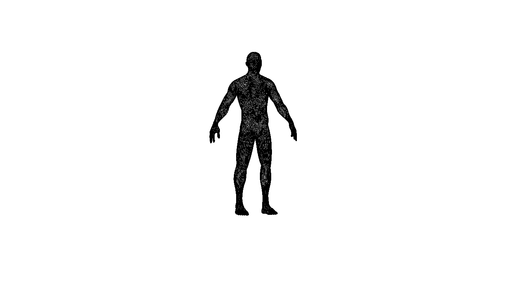

# 3D viewer
Program for viewing .obj files. Supports scaling, moving, rotating, setting colours, recording GIFs, exporting to jpeg and bmp.

## Stack:
C++, QT6, STL, OpenGL.
## Patterns:
Facade, Strategy, Command.
